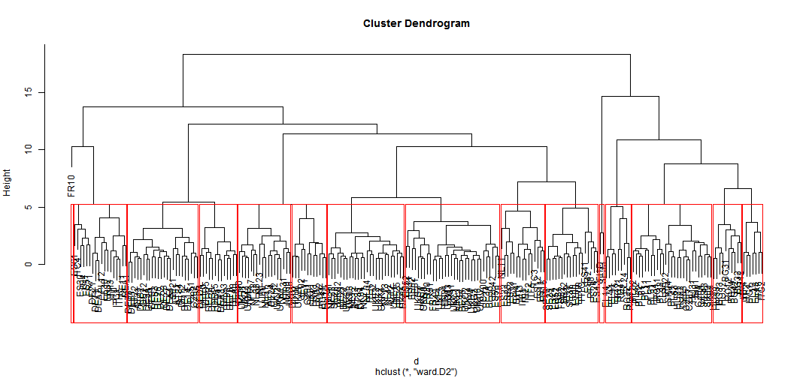
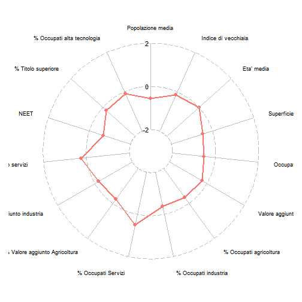
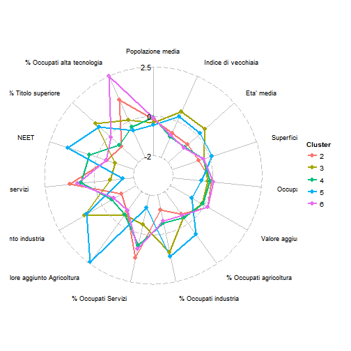
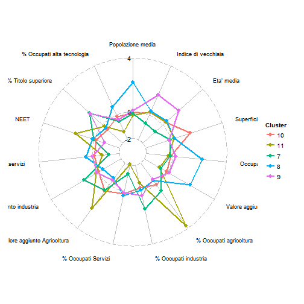
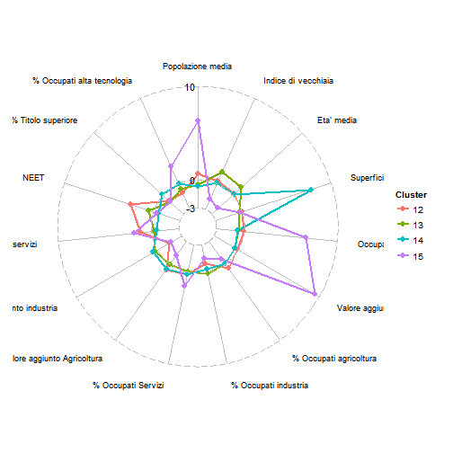
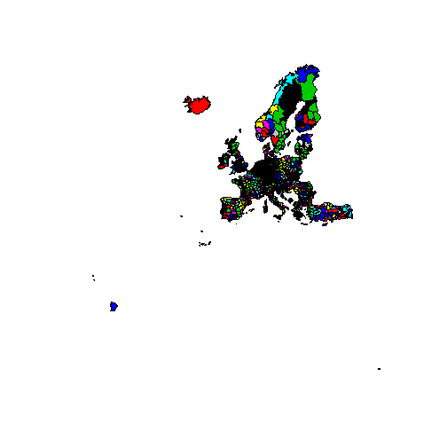

# Regional Clustering
## Obiettivi della ricerca

L'obiettivo del documento e' trovare un insieme di regioni europee che si ritengono essere strutturalmente simili alla Provincia Autonoma di Trento su cui poi potersi poi confrontare su  indicatori obiettivo.
La metodologia proposta prevede la costruzione di cluster basati su indicatori "strutturali" ritenuti importanti e caratterizzanti della realta' provinciale.  
Gli indicatori che si e' pensato rappresentativi della situazione demografica e economica regionale sono:
* **Demografia**:
  - Popolazione media
  - Indice di vecchiaia
  - Eta' media
  - Superficie
* **Economia**:
  - Addetti nell'industria
  - Addetti nei servizi
  - Addetti totali
  - Valore aggiunto totale
  - Percentuale di valore aggiunto dall'agricoltura
  - Percentuale di valore aggiunto dall'industria
  - Percentuale di valore aggiunto dai servizi
  - Occuapti totali
  - Percentuale di occupati nell'agricoltura
  - Percentuale di occupati nell'industria
  - Percentuale di occupati nei servizi
* **Istruzione**:
  - NEET
  - Percentuale di persone 25-64 con almeno diploma superiore
* **Ricerca e innovazione**:
  - Percentuale di occupati in settori ad alto contenuto tecnologico o ad alta intensita' di conoscenza  
  
Poiche' la procedura di clustering non puo' lavorare con i valori NULL sono costretto a eliminare tutte le righe in cui compare un NA. 
In partioclare gli indicatori riguardanti gli addetti sono mancanti su molte regioni e interi stati, particolarmente REGNO UNITO, GERMANIA e BELGIO. Delle 272 regioni europee ne rimarebbero utilizzabili solo 136.
Considerata l'importanza di queste regioni ho ritenuto opportuno eliminare gli indicatori piuttosto che le righe.

## Risultati

L'analisi ha portato a determinare un cluster di regioni europee caratterizzate da una dimensione medio-piccola, con popolazione più bassa della media. I territori selezionati si contraddistinguono inoltre per una predominanza del settore terziario a scapito del settore industriale e agricolo. Molto piu' basso della media europea e' il numero di NEET
********
# Metodologia
## Preparazione dataset


Leggo i dati preparati da Paolo nel file 'LASTVALUE.csv'


```r
indOrig <-
    read.csv2(
        'LASTVALUE.csv', sep = ',', skip = 21, header = T, stringsAsFactors = F
    )
```

Il Dataset e' composto da 272 osservazioni su 18 variabili


Poiche' i valori fanno riferimento a fenomeni diversi tra loro standardizzo gli indicatori.


```r
ind <- scale(indOrig[5:19])
row.names(ind) <- indOrig$GEO
```

***
## K-Medie
Il metodo di clustering delle K-Medie e' il piu' utilizzato. Richiede che l'analista specifici il numero di cluster da estrarre. Un grafico della somma dei quadrati all'interno dei gruppi per il numero di cluster estratti puo' aiutare a scegliere il numero piu' appropriato di cluster. L'analista decide la numerosita' di cluster individuando il punto in cui l'aggiunta di un cluster (asse orizzontale) non comporta un significativo aumento dell'informazione (asse verticale).
Tuttavia dopo approfondita analisi il metodo delle K-Medie non risulta adeguato nel caso specifico, in quanto i punti sono troppo ravvicinati tra loro, e non si conformano a dei cluster chiaramente separati, e quindi la procedura delle K-Medie non riesce a determinare i cluster in modo deterministico.
Il grafico di seguito mostra la rappresentazione dei punti su uno spazio tridemnsionale utlizzando le prime tre componenti principali.


***
## Metodo gerarchico
Si decide percio' di utilizzare un metodo di clustering gerarchico, che accoppia via via i punti piu' vicini nello spazio. Si rende pero' necessario decidere il tipo di distanza da utilizzare, il metodo di clusterizzazione e infine il numero di cluster.
Si sceglie di utilizzare la distanza massima per minimizzare le differenze; si sceglie cioe' come distanza tra due punti il massimo tra le distanze di ogni dimensione


```r
# Matrice delle distanze
d <- dist(ind, method = "maximum")
# Crea l'albero
fit <- hclust(d, method="ward.D2") 
# Disegna il grafico
plot(fit)
# Divide l'albero all'altezza di 15 cluster
group <- cutree(fit, k=15)
# Disegna i rettangoli rossi attorno ai 15 cluster
rect.hclust(fit, k=15, border="red")
```

 

***
## Analisi dei cluster
Trento (ITH2) risulta essere all'interno del cluster numero 1


Il cluster 2 risulta essere cosi' composto:

<!-- html table generated in R 3.2.2 by xtable 1.8-0 package -->
<!-- Tue Nov 24 09:18:18 2015 -->
<table border=1>
<tr> <th> NUTS2 </th> <th> Denominazione </th> <th> Stato </th>  </tr>
  <tr> <td> AT12 </td> <td> Niederösterreich </td> <td> AUSTRIA </td> </tr>
  <tr> <td> AT32 </td> <td> Salzburg </td> <td> AUSTRIA </td> </tr>
  <tr> <td> AT33 </td> <td> Tirol </td> <td> AUSTRIA </td> </tr>
  <tr> <td> BE21 </td> <td> Prov. Antwerpen </td> <td> BELGIO </td> </tr>
  <tr> <td> BE22 </td> <td> Prov. Limburg (BE) </td> <td> BELGIO </td> </tr>
  <tr> <td> BE23 </td> <td> Prov. Oost-Vlaanderen </td> <td> BELGIO </td> </tr>
  <tr> <td> BE25 </td> <td> Prov. West-Vlaanderen </td> <td> BELGIO </td> </tr>
  <tr> <td> DK02 </td> <td> Sjælland </td> <td> DANIMARCA </td> </tr>
  <tr> <td> DK03 </td> <td> Syddanmark </td> <td> DANIMARCA </td> </tr>
  <tr> <td> DK04 </td> <td> Midtjylland </td> <td> DANIMARCA </td> </tr>
  <tr> <td> DK05 </td> <td> Nordjylland </td> <td> DANIMARCA </td> </tr>
  <tr> <td> ITH1 </td> <td> Provincia Autonoma di Bolzano/Bozen </td> <td> ITALIA </td> </tr>
  <tr> <td> ITH2 </td> <td> Provincia Autonoma di Trento </td> <td> ITALIA </td> </tr>
  <tr> <td> NL12 </td> <td> Friesland (NL) </td> <td> PAESI BASSI </td> </tr>
  <tr> <td> NL13 </td> <td> Drenthe </td> <td> PAESI BASSI </td> </tr>
  <tr> <td> NL21 </td> <td> Overijssel </td> <td> PAESI BASSI </td> </tr>
  <tr> <td> NL22 </td> <td> Gelderland </td> <td> PAESI BASSI </td> </tr>
  <tr> <td> NL34 </td> <td> Zeeland </td> <td> PAESI BASSI </td> </tr>
  <tr> <td> NL41 </td> <td> Noord-Brabant </td> <td> PAESI BASSI </td> </tr>
  <tr> <td> NL42 </td> <td> Limburg (NL) </td> <td> PAESI BASSI </td> </tr>
  <tr> <td> SE22 </td> <td> Sydsverige </td> <td> SVEZIA </td> </tr>
  <tr> <td> UKE1 </td> <td> East Yorkshire and Northern Lincolnshire </td> <td> REGNO UNITO </td> </tr>
  <tr> <td> UKE2 </td> <td> North Yorkshire </td> <td> REGNO UNITO </td> </tr>
  <tr> <td> UKG1 </td> <td> Herefordshire, Worcestershire and Warwickshire </td> <td> REGNO UNITO </td> </tr>
  <tr> <td> UKK2 </td> <td> Dorset and Somerset </td> <td> REGNO UNITO </td> </tr>
  <tr> <td> UKK4 </td> <td> Devon </td> <td> REGNO UNITO </td> </tr>
   </table>
    Error in install.packages : Updating loaded packages
OGR data source with driver: ESRI Shapefile 
Source: "./NUTS_2010_60M_SH/data", layer: "NUTS_RG_60M_2010"
with 1920 features
It has 4 fields

```
## Warning in right_join_impl(x, y, by$x, by$y): joining factor and character
## vector, coercing into character vector
```

 

